# FlyPorter

## Table of Contents

- [Team Information](#team-information)
- [Video Demo](#video-demo)
- [Motivation](#motivation)
- [Objectives](#objectives)
- [Technical Stack](#technical-stack)
- [Features](#features)
- [User Guide](#user-guide)
- [Development Guide](#development-guide)
- [Contribution Guidelines](#contribution-guidelines)
- [Deployment Information](#deployment-information)
- [Individual Contributions](#individual-contributions)
- [Lessons Learned and Concluding Remarks](#lessons-learned-and-concluding-remarks)

---

Backend stack: Express.js + TypeScript + Prisma + PostgreSQL

---
---
## User Guide
### Search Without Logging in
FlyPorter allows users to search for available flights without authentication.
Booking and seat selection require a login, and users attempting to proceed without signing in will be redirected to the login page.


### Registration & Login


#### Test Credentials

| Role   | Email           | Password |
| ------ | --------------- | -------- |
| Admin  | admin@123.com   | admin123 |
| User   | customer.one@example.com  | password123 |
| User   | customer.two@example.com  | password123 |
#### User Sign in

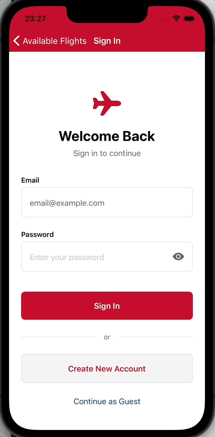

#### User Create Account
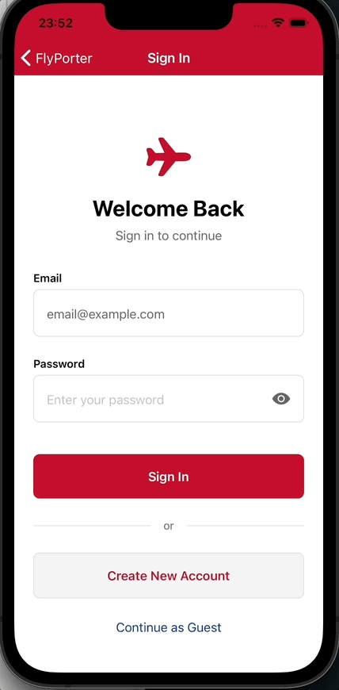
#### Admin Sign in
Admins authenticate through the same login flow with role-based access control and are redirected to the management dashboard.
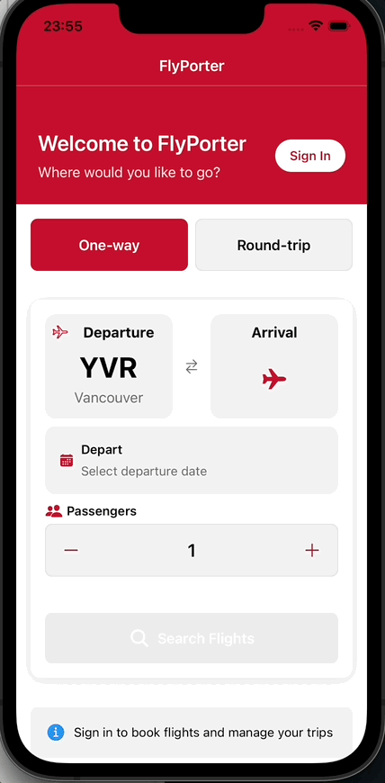


### Admin Features (Admin Users Only)
#### Admin View
The admin dashboard provides a centralized overview of flights, customers, and booking status.
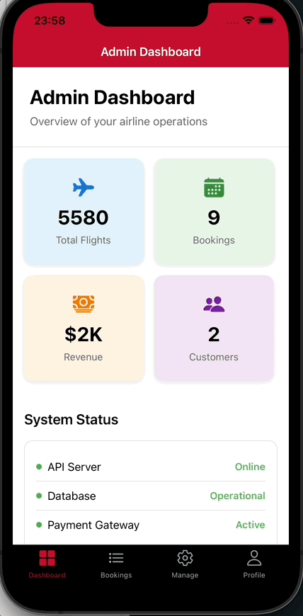
#### Bookings Management
Admins can modify or cancel bookings with immediate database updates.

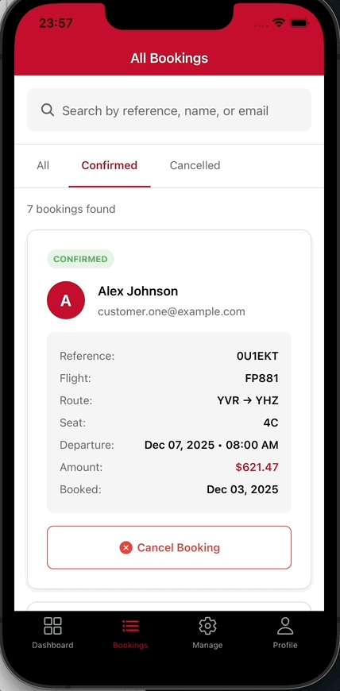

### Normal User Features
Normal users can search for flights, select seats, make bookings, and manage their reservations through an intuitive interface.
#### Flight Search
Features include:
- Choose between one-way or round trip
- Enter origin and destination (with autocomplete suggestions)
- Select departure date (and return date for round trips)
- Select number of passengers

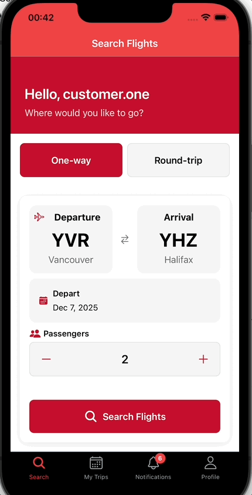


#### Seat Selection and Booking
Users select seats across three cabin classes (**Economy**, **Business**, **First Class**) using an interactive seat map with real-time occupancy locking and availability indicators:

- **AVAILABLE** — Open for selection  
- **SELECTED** — Seat chosen by the user  
- **OCCUPIED** — Reserved by other passengers

Complete your booking by filling in passenger information. You can:

- Use your profile
- Or enter a new passenger's details (name, passport number, and birth date)
- Review price
- Continue to payment

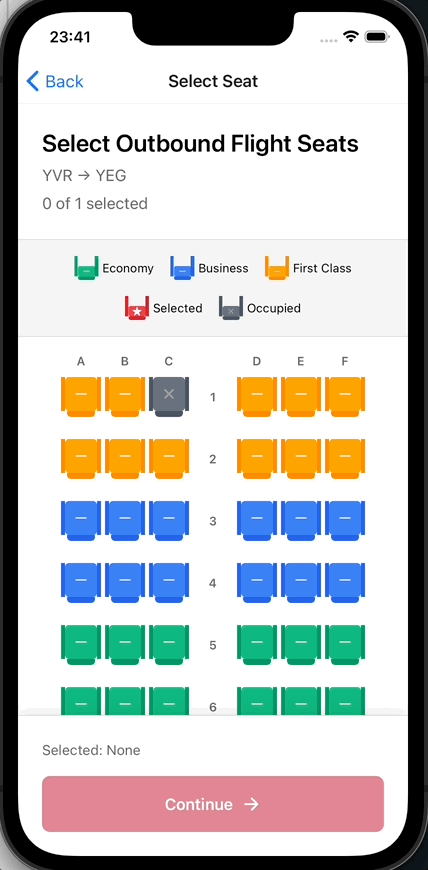

#### Payment
Enter the card details and review the booking summary, containing flight number, Departure and destination airports, seat number, price and total amount.

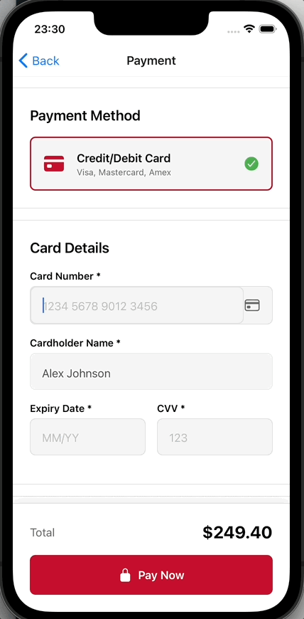


#### Round-trip Search Flight

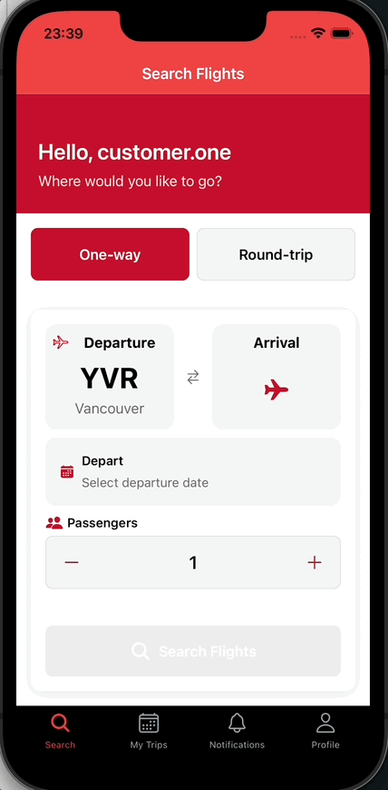

#### Round-trip Book Flight (select seats)

Users select seats for both outbound and return flights in sequence.

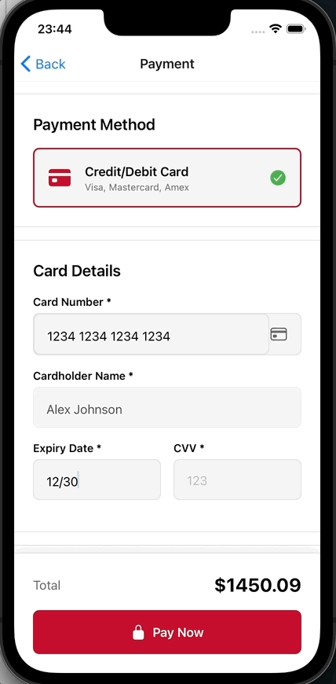

#### View Flight Details
Access your bookings from _My Trips_:

- View all your current and past bookings
- See flight details, seat numbers, and booking status
- Cancel bookings
- Modify seat selections

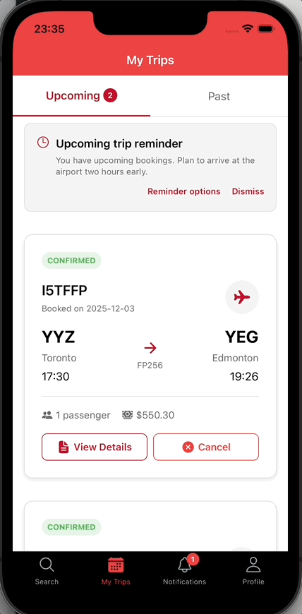

#### Profile Management
Manage your profile from the profile page:

- Edit existing information (name, phone number, passport number, and birth date)
- Use the profile for quick booking
- 
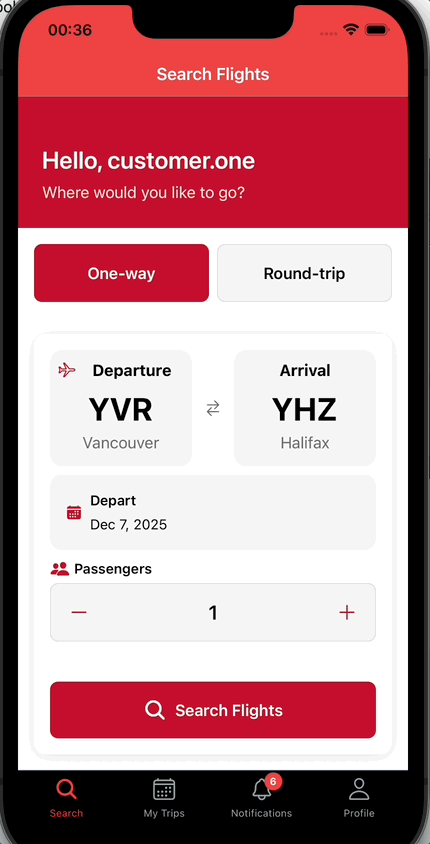


---


## Development Guide

### Database Setup

#### Install PostgreSQL and create the database

1. Download and install PostgreSQL from https://www.postgresql.org/download/

   - Mac/Linux Setup via Homebrew:

     ```
     /bin/bash -c "$(curl -fsSL https://raw.githubusercontent.com/Homebrew/install/HEAD/install.sh)"
     brew install postgresql
     ```

     start psql

     ```
     brew services start postgresql
     ```

     or if your version is 16:

     ```
     brew services start postgresql@16
     ```

   - Windows Setup: Download and run the installer to install and start PostgreSQL

2. Create a new database named `flyporter_db`:
   ```
   createdb flyporter_db
   ```
   > Note: On Windows, if you don't know the PostgreSQL password for your Windows username,
   > use the following command instead (the installer only sets up the password for the `postgres` user):
   >
   > ```
   > createdb flyporter_db -U postgres
   > ```

#### Set up the Prisma schema

Under `backend` folder:

```
cd backend
```

1. Install dependencies:

   ```
   npm install
   ```

2. For convenience, we provide `.env.dev` for local development. Simply copy it to `.env` and update the database credentials. For custom Google OAuth 2.0 and DigitalOcean Spaces configuration, use `.env.example` as a template.

   ```
   cp .env.dev .env
   ```

   > Note: You need to chenge `username` to your psql username, `password` to your psql password.

3. Run the migration:

   ```
   npx prisma migrate dev --name init
   ```

   This creates and runs the SQL migration file and generates an Entity Relationship Diagram.

4. Verify the setup:
   - Check for `backend/prisma/migrations/<yyyyMMddHHmmss>_init/migration.sql`
   - Verify `backend/prisma/ERD.svg` exists
   - Confirm tables are created in the `flyporter_db` database

> Reset and re-create the prisma schema (Optional, only if you want to reset the database from a previous schema)
>
> 1. Delete `backend/prisma/migrations` folder.
> 2. Reset the prisma schema
>    ```
>    npx prisma migrate reset
>    ```
> 3. Re-create the prisma schema
>    ```
>    npx prisma migrate dev --name init
>    ```

### Seed the Database

Under `backend` folder:

1. Seed initial data (run once per fresh setup)

   ```
   cd backend
   npx prisma db seed
   ```

   This creates:

   - Admin user
   - Demo customer user with passenger profiles:
     - `customer.one@example.com` / `password123`
     - `customer.two@example.com` / `password123`
   - 4 Cities: Toronto, Vancouver, Montreal, Ottawa
   - 4 Airports: YYZ, YVR, YUL, YOW
   - 2 Airlines: FlyPorter, Air Canada
   - 6 Routes between the cities
   - 3 future-dated flights with generated seats (ready to book)

2. Re-seed (optional)

   - You can run `npx prisma db seed` again to add the same baseline data if you cleared the tables.
   - For a clean reset, run:
     ```
     npx prisma migrate reset
     npx prisma db seed
     ```

3. Quick test (optional)
   - Start the server (see below), then import `backend/FlyPorterAPI.postman_collection.json` into Postman.
   - Follow the flow: `GET /flight` → `GET /seat/{flightId}` → `POST /auth/register|login` → `PATCH /profile` (add name, passport, DOB) → `POST /payment/validate` → `POST /bookings`.
   - See `backend/POSTMAN_GUIDE.md` for details.

### Run the Backend Server after Database Setup

Under `backend` folder:

1. Install dependencies
   ```
   npm install
   ```
2. Start the server
   ```
   npm start
   ```
   OR
   ```
   npm run dev
   ```
3. Check the backend API documentation at `https://editor.swagger.io/`
   ```
   Import FlyPorterAPI_openapi.yaml
   ```
   Or import FlyPorterAPI.postman_collection.json to your postman

Transfer postman collection to openapi
postman-to-openapi FlyPorterAPI.postman_collection.json FlyPorterAPI_openapi.yaml

### Postman Collection Demo

#### 1. Create a Workspace

Start by creating a new workspace in Postman.

#### 2. Import API Collection

Import the `FlyPorter.postman_collection.json` file into your workspace.

#### 3. Create an Environment

In the top-left corner, create a new environment.  
The environment is used to store the authentication token after login (the token is automatically saved via the Postman script in the login API's response).

> Note:  
> You must run the `Login API` first to authenticate and get the token before accessing other APIs. Check out environment variables.

#### API Usage Made Easy

All sample inputs (parameters, request bodies) are pre-configured.  
As a developer, you do not need to manually input anything — just select the API you want to test and click Send.

### Docker Instruction

### 1. Start Docker

Open **Docker Desktop** and verify it’s running:

```sh
docker --version
docker info
```

---

### 2. Build and Run with Docker Compose

```sh
docker compose build
```

Run in foreground:

```sh
docker compose up
```

Or run in background:

```sh
docker compose up -d
```

---

### Optional Commands

```sh
docker ps                 # list running containers
docker compose down       # stop and remove containers
```

---

## Deployment Information

### Mobile App Deployment with Expo EAS Build

FlyPorter uses [Expo Application Services (EAS)](https://expo.dev/eas) for building and deploying the mobile application.

#### Latest Builds

| Platform | Build Link |
| -------- | ---------- |
| Android | [Download from EAS](https://expo.dev/accounts/ece1778-flyporter-mobile/projects/flyporter/builds/9ef85805-37f4-4c84-9432-fa96a264aee7) |
| iOS | [Download from EAS](https://expo.dev/accounts/ece1778-flyporter-mobile/projects/flyporter/builds/0d3a8357-c64c-4c26-9ddc-f08b2d4e37b2) |

#### Prerequisites

1. Install EAS CLI globally:
   ```sh
   npm install -g eas-cli
   ```

2. Log in to your Expo account:
   ```sh
   eas login
   ```

3. Navigate to the frontend folder:
   ```sh
   cd frontend
   ```

#### Build Profiles

The project has three build profiles configured in `eas.json`:

| Profile       | Purpose                          | Distribution |
| ------------- | -------------------------------- | ------------ |
| `development` | Development client for debugging | Internal     |
| `preview`     | Internal testing builds          | Internal     |
| `production`  | App Store / Play Store releases  | Store        |

#### Building for iOS

**Development Build (for simulators and registered devices):**
```sh
eas build --profile development --platform ios
```

**Preview Build (for internal testers):**
```sh
eas build --profile preview --platform ios
```

**Production Build (for App Store submission):**
```sh
eas build --profile production --platform ios
```

> Note: iOS builds require an Apple Developer account. EAS will guide you through creating necessary certificates and provisioning profiles.

#### Building for Android

**Development Build:**
```sh
eas build --profile development --platform android
```

**Preview Build (APK for internal testing):**
```sh
eas build --profile preview --platform android
```

**Production Build (AAB for Play Store):**
```sh
eas build --profile production --platform android
```

#### Building for Both Platforms

```sh
eas build --profile <profile-name> --platform all
```

#### Building APK Files (Android)

By default, production builds generate AAB (Android App Bundle) files for Play Store. To build an APK file for direct installation or testing:

**Option 1: Use the preview profile (already configured for APK)**
```sh
eas build --profile preview --platform android
```

**Option 2: Create a custom APK profile**

Add an `apk` profile to your `eas.json`:
```json
{
  "build": {
    "apk": {
      "android": {
        "buildType": "apk"
      }
    }
  }
}
```

Then run:
```sh
eas build --profile apk --platform android
```

**Option 3: One-time APK build without modifying config**

You can override the build type directly:
```sh
eas build --platform android --profile production --local --output ./app.apk
```

After the build completes, download the APK from the Expo dashboard or use:
```sh
eas build:list --platform android
# Copy the build URL and download, or click the link in the Expo dashboard
```

#### Building IPA Files (iOS)

IPA files are generated for iOS distribution. Different build types produce different IPA variants:

**Development IPA (for registered devices):**
```sh
eas build --profile development --platform ios
```

**Ad-Hoc IPA (for internal testers via TestFlight alternative):**
```sh
eas build --profile preview --platform ios
```
> The preview profile is configured with `enterpriseProvisioning: "adhoc"` for internal distribution.

**App Store IPA (for TestFlight and App Store):**
```sh
eas build --profile production --platform ios
```

**Downloading Built Files:**

After a successful build:
1. Visit [expo.dev](https://expo.dev) and navigate to your project builds
2. Click on the completed build to download the IPA/APK file
3. Or use the CLI to get the download URL:
   ```sh
   eas build:list --platform ios --status finished
   ```

**Installing IPA on Device:**
- For ad-hoc builds: Use tools like Apple Configurator, Diawi, or install via Xcode
- For App Store builds: Upload to App Store Connect for TestFlight distribution

**Installing APK on Device:**
- Transfer the APK to your Android device
- Enable "Install from unknown sources" in device settings
- Open the APK file to install

#### Submitting to App Stores

**Submit to Apple App Store:**
```sh
eas submit --platform ios
```

**Submit to Google Play Store:**
```sh
eas submit --platform android
```

Or build and submit in one command:
```sh
eas build --profile production --platform ios --auto-submit
eas build --profile production --platform android --auto-submit
```

#### Over-the-Air (OTA) Updates

FlyPorter supports OTA updates via EAS Update. Push updates without rebuilding:

```sh
eas update --branch production --message "Description of update"
```

For preview channel:
```sh
eas update --branch preview --message "Description of update"
```

#### Checking Build Status

View your builds on the Expo dashboard or via CLI:
```sh
eas build:list
```

#### Local Builds (Optional)

For local builds without EAS cloud:
```sh
eas build --profile development --platform android --local
eas build --profile development --platform ios --local
```

> Note: Local iOS builds require a macOS machine with Xcode installed.

---

## Individual Contributions

### Yuan Wang
- Frontend (Admin):
  - Admin Dashboard with overview statistics
  - Bookings management list view
  - Booking details view and cancellation
  - Customer and flight management interface

### Yiyang Liu
- Frontend (Customer):
  - Flight search with one-way and round-trip support
  - Airport picker with autocomplete suggestions
  - Flight results listing and details view
  - Interactive seat selection with cabin class support
  - Passenger information form
  - Payment processing screen
  - Booking confirmation and summary
  - My Bookings list and booking details
  - User profile management
  - Push notifications screen
